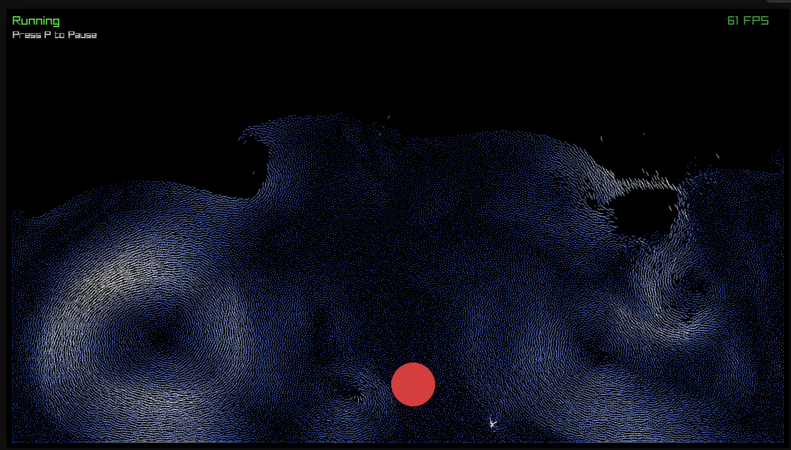

# Zig Flip Fluid Simulation | ZFF

This project is a Zig port of the FLIP-Fluid simulation from Matthias Müller's Ten Minute Physics series.



## Installation & Usage

### Prerequisites

- Zig 0.16.0

### Building and Running

Clone the repository:

```bash
git clone https://github.com/burakssen/zff
cd zff
```

### Build and run the simulation (native):

```bash
zig build run -Doptimize=ReleaseFast
```

### Running Tests:

```bash
zig build test
```

### WebAssembly Build

To build for WebAssembly using Emscripten:

```bash
zig build -Doptimize=ReleaseFast -Dtarget=wasm32-emscripten
```

The output will be in `zig-out/web/` and can be served from there directly.

## Controls

- **P**: Pause / Resume simulation
- **M**: Advance 1 step when paused
- **Left Mouse Click & Drag**: Move obstacle sphere

Original implementation: [Matthias Müller's FLIP simulation](https://www.youtube.com/watch?v=XmzBREkK8kY&feature=youtu.be)

## LICENCE

This project is licensed under the MIT License. See the LICENCE file for details.

